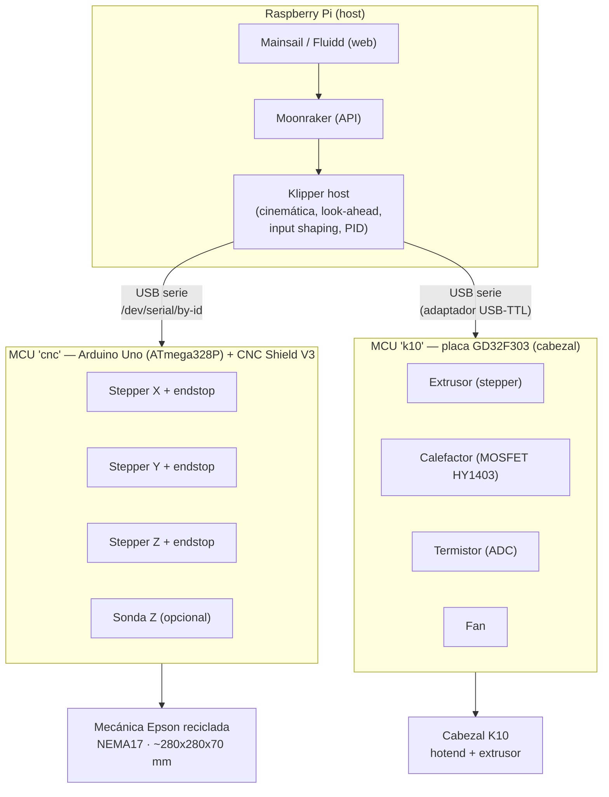

# Diagrama — Arquitectura del sistema

## Vista lógica (multi-MCU Klipper)



## Vista física (alimentación y masas)

```
   Fuente potencia (12-24V) ──► CNC Shield ──► motores NEMA17 (XYZ)
   Fuente K10 (~12V)        ──► placa K10  ──► calefactor + extrusor
   Fuente 5V/3A             ──► Raspberry Pi
                                  │
                                  ├─USB─► Arduino Uno (lógica + CNC Shield)
                                  └─USB─► adaptador USB-TTL ─UART(3.3V)─► GD32 K10

   ⚠️ TODAS las masas (GND) unidas. Señales al GD32 a 3.3V. Ver docs/06.
```

> Opción B/C: el bloque "MCU k10" se sustituye por un board de impresora con pinout conocido
> (sin reversing ni soldadura SMD). La topología lógica es idéntica.
