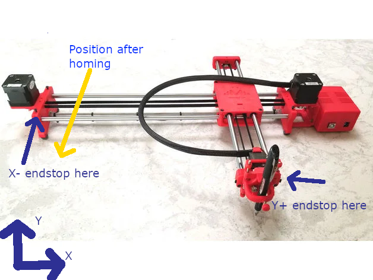

# Diagrama — CNC Shield V3 (Arduino Uno) → pines Klipper

Verificado contra el fuente de GRBL (`cpu_map_atmega328p.h`) y `repos/klipper-drawbot`.
Correspondencia Arduino→ATmega:  **D0–D7 = PD0–PD7** · **D8–D13 = PB0–PB5** · **A0–A5 = PC0–PC5**.

---

## Fotos de referencia (montaje real Arduino Uno + CNC Shield + drivers)




> Pinout gráfico oficial del CNC Shield V3 (no se puede incrustar por hotlink, ábrelo):
> Protoneer wiki <https://blog.protoneer.co.nz/arduino-cnc-shield/> ·
> Keyestudio <https://wiki.keyestudio.com/Ks0160_keyestudio_CNC_Shield_V3>

---

## Mapa de la shield (vista superior) — ASCII

```text
                        CNC SHIELD V3  (sobre Arduino Uno)
       +------------------------------------------------------------------+
       | ENABLE = D8 (PB0)  comun a los 4 drivers                         |
       |                                                                  |
       |   [ X ]        [ Y ]        [ Z ]        [ A ]                   |
       |   STEP = D2     STEP = D3    STEP = D4    (clon de X/Y/Z         |
       |   DIR  = D5     DIR  = D6    DIR  = D7     por jumpers, no usar) |
       |                                                                  |
       | Endstops:   X+ = D9 (PB1)    Y+ = D10 (PB2)    Z+ = D12 (PB4)    |
       | Spindle/servo: D11 (PB3, PWM HW)      SpinDir: D13 (PB5)         |
       | Abort A0 . Hold A1 . Resume A2 . Coolant A3                      |
       +------------------------------------------------------------------+
```

## Traducción a Klipper

```text
   stepper_x:   step=PD2   dir=PD5   enable=!PB0   endstop=^PB1
   stepper_y:   step=PD3   dir=PD6   enable=!PB0   endstop=^PB2
   stepper_z:   step=PD4   dir=PD7   enable=!PB0   endstop=^PB4   <-- PB4, no PB3
   (pin libre para sonda/servo: PB3 o PB5 si no usas spindle)
```

| Eje | STEP | DIR | ENABLE | ENDSTOP    |
|-----|------|-----|--------|------------|
| X   | PD2  | PD5 | !PB0   | ^PB1 (D9)  |
| Y   | PD3  | PD6 | !PB0   | ^PB2 (D10) |
| Z   | PD4  | PD7 | !PB0   | ^PB4 (D12) |

---

## Jumpers de microstepping (debajo de cada driver A4988/DRV8825)

```text
   MS1  MS2  MS3
    o    o    o     <- recomendado 1/16: los TRES jumpers PUESTOS (H H H en A4988)
                       NO uses 1/32 con el ATmega328P (riesgo "Timer too close").
```

| MS1 | MS2 | MS3 | A4988 | DRV8825 |
|-----|-----|-----|-------|---------|
| L   | L   | L   | full  | full    |
| H   | H   | H   | 1/16  | 1/16    |
| L   | L   | H   | 1/16  | 1/32    |

---

## Ajuste de corriente (Vref), medido con multímetro

```text
   A4988  (Rcs=0.1 ohm):   Vref = I_motor x 0.8     ej. 1.2 A -> 0.96 V
   DRV8825(Rcs=0.1 ohm):   Vref = I_motor / 2       ej. 1.2 A -> 0.60 V
   Mide entre el tornillo del potenciometro y GND. Apunta a ~70-85% de la I nominal del NEMA17.
```

## Aviso de ambiguedad del endstop Z

```text
   Shield V3 estandar (GRBL con VARIABLE_SPINDLE):  Z+ va a D12 = PB4.
   Si TU shield lleva Z+ a D11 -> seria PB3 (pero pierdes el pin PWM/servo).
   VERIFICA con multimetro a que pin del Arduino llega el header Z+/Z-.
```

Ref: [docs/03](../docs/03-hardware-cnc.md) ·
GRBL cpu_map <https://github.com/grbl/grbl/blob/master/grbl/cpu_map/cpu_map_atmega328p.h>
