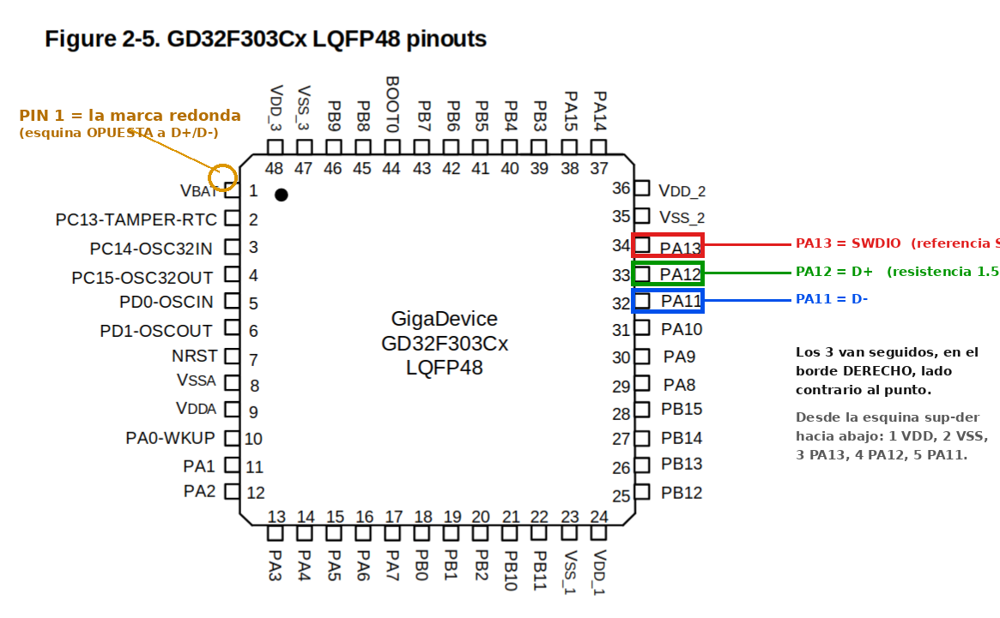

# Esquema de soldadura — USB nativo del GD32 (K10)

Opción **preferida** para comunicar la K10 con Klipper: usar el **USB nativo del GD32F303**
(PA11 = D−, PA12 = D+) llevándolo a un puerto/cable USB, con la **pull-up de 1.5 kΩ obligatoria
en D+**. La K10 aparecerá directamente como dispositivo Klipper (`/dev/serial/by-id/usb-Klipper_...`),
sin adaptador ni GPIO.

> Fuentes: Klipper sobre STM32F103 por USB
> <https://klipper.discourse.group/t/klipper-support-on-stm32f103-over-usb/25074> ·
> GD32F303 (Creality 4.2.2) <https://klipper.discourse.group/t/support-for-new-creality-boards-4-2-2-with-gd32f303/3016> ·
> El STM32F103/GD32F303 **no** trae pull-up interna en D+ → hay que añadirla externa.

---

## 1. Esquema eléctrico

```text
                     3.3 V
                       |
                  +----+----+
                  |  1.5 kΩ |   (pull-up OBLIGATORIA en D+; sin ella el USB NO enumera)
                  +----+----+
                       |
   GD32F303            |  nodo D+
   (placa K10)         |
   PA12  (USB D+) o----+--------------->  D+   (verde)   ----.
                                                              |
   PA11  (USB D-) o--------------------->  D-   (blanco)  ----+---> cable USB a la Raspberry Pi
                                                              |
   GND            o--------------------->  GND  (negro)   ----'
                                          VBUS +5V (rojo) = NO conectar al MCU
```

Notas eléctricas:
- **3.3 V para la pull-up**: tómalo del riel de 3.3 V de la placa (salida del **AMS1117**) o de un pin
  **VDD** del GD32. NO de 5 V.
- **VBUS (+5V, hilo rojo del USB): NO se conecta** al MCU. La K10 se alimenta por su propia DC; el USB
  solo aporta datos + masa.
- **GND común**: el hilo negro del USB une la masa de la K10 con la de la Pi (imprescindible).
- **D+ y D− cortos y trenzados** entre sí (son señal diferencial a 12 Mbit/s). Cuanto más cortos, mejor.
- Opcional pero recomendable: **22 Ω en serie** en cada línea D+/D− cerca del MCU (mejora integridad de
  señal). No es imprescindible para tramos cortos; la de **1.5 kΩ en D+ sí lo es**.

---

## 2. Localizar PA11 / PA12 en el chip

El reversing confirmó **SWDIO = PA13** y **SWCLK = PA14**. Usa SWDIO como referencia: los pines de USB
están justo al lado. Esta secuencia del borde es igual en LQFP48 y LQFP64 (solo cambia la numeración).

```text
   borde del GD32 (LQFP) — misma secuencia en 48 y 64 pines:
  +---++----++----++----++-----++---++---++-----++----+
   PA9  PA10  PA11  PA12   PA13  VSS  VDD   PA14  PA15 
  +---++----++----++----++-----++---++---++-----++----+
               D-    D+   SWDIO            SWCLK       

   Desde SWDIO (PA13), hacia el lado opuesto a VSS/VDD:
   PA13(SWDIO) -> PA12(D+) -> PA11(D-) -> PA10 -> PA9
```

Verifica SIEMPRE con multímetro (continuidad) antes de soldar: PA13 debe dar continuidad con el pad de
SWDIO que ya identificaste en el reversing; el contiguo es PA12 (D+).

> ⚠️ **Sobre la marca redonda (punto) del MCU:** ese punto marca el **pin 1 (VBAT)** y está en la
> esquina **DIAGONALMENTE OPUESTA** a PA11/PA12. Es normal que NO coincida con los pines que vas a
> soldar: D+/D− están en el lado contrario al punto. No es un error.
>
> En tu foto (punto arriba-izquierda, cristal a la izquierda) los pines de USB están en el **borde
> DERECHO**. Contando desde la esquina superior-derecha hacia abajo:
> **1 = VDD, 2 = VSS, 3 = PA13 (SWDIO), 4 = PA12 (D+), 5 = PA11 (D−).**

### Fotos de referencia



---

## 3. Colores estándar de un cable USB-A (al cortarlo)

| Hilo | Señal | Conecta a |
|-------|--------|------------------------------|
| Rojo  | VBUS +5V | **NO conectar** (la K10 se autoalimenta) |
| Blanco| D−       | PA11 del GD32 |
| Verde | D+       | PA12 del GD32 (+ pull-up 1.5 kΩ a 3.3 V) |
| Negro | GND      | GND de la K10 (masa común) |

> Si el cable no respeta colores, identifícalos con multímetro contra un conector USB-A conocido
> (pin 1=VBUS, 2=D−, 3=D+, 4=GND).

---

## 4. Procedimiento de soldadura

1. **Placa sin alimentar.** Pulsera antiestática.
2. Localiza y **verifica** PA12 (D+) y PA11 (D−) con multímetro (sección 2).
3. Suelda la **pull-up de 1.5 kΩ** entre PA12 (D+) y el riel de 3.3 V (salida AMS1117 o VDD). Es el
   punto crítico.
4. Suelda hilos finos (AWG30) a PA12 (D+) y PA11 (D−), **cortos y trenzados** entre sí.
5. Suelda GND a un punto de masa cómodo.
6. Conecta esos hilos a los del cable USB: verde→D+, blanco→D−, negro→GND. **Rojo (VBUS) aislado.**
7. Fija todo con kapton/pegamento (alivio de tensión).
8. Enchufa el USB a la Pi y alimenta la K10 por su DC.
9. En la Pi: `ls /dev/serial/by-id/*` → debe aparecer `usb-Klipper_stm32f103xe_...` (tras flashear Klipper).

---

## 5. Klipper para esta opción (menuconfig)

```text
Micro-controller Architecture: STMicroelectronics STM32
Processor model: STM32F103
Bootloader offset: 16KiB bootloader     (K10: el cargador escribe en 0x4000 = 16 KiB; "No bootloader" si flasheas por SWD)
Communication interface: USB (on PA11/PA12)      <-- ESTA es la clave de la opción USB nativo
[*] Disable SWD at startup (GD32)
```

Tras `make`, flashea por SWD o SD (ver [docs/05](../docs/05-flasheo-klipper.md)). En `[mcu k10]`:
`serial: /dev/serial/by-id/usb-Klipper_stm32f103xe_XXXX-if00`.

> ⚠️ **Importante — el USB nativo NO enumera hasta que Klipper esté flasheado.** El periférico USB del
> GD32 lo activa el *firmware*; no es un chip USB-serie autónomo (CH340/FT232). Con el firmware de
> fábrica (EasyThreed), conectar el cable a la PC no produce **nada** (ni "dispositivo desconocido").
> Por eso el **primer** flasheo debe ir por **SWD o microSD**, nunca por USB. Solo después de tener
> Klipper dentro aparecerá `/dev/serial/by-id/usb-Klipper_...` y servirá para validar esta soldadura.

---

## 6. Flasheo por microSD (datos reales del bootloader de la K10)

> Fuente: reversing de la placa K10 (palmarci)
> <https://palmarci.me/blog/2025-05-02-easythreed-k10-3d-printer-main-board-reversing/index.html>

La K10 **NO** usa el bootloader MKS de la K9. No busca `mksLite.bin`. Su cargador propio busca:

| Dato | Valor en la K10 |
|------|------------------|
| MCU | **GD32F303CBT6** (Cortex-M4, **LQFP48**, 128 KB flash, 48 KB RAM) — confirmado por el marcado del chip; el reversing de palmarci citaba un RCT6/LQFP64, pero esta placa monta el CBT6 de 48 pines |
| Fichero de firmware que busca en la raíz de la SD | **`p10_printer.bin`** |
| Offset de escritura | **`0x4000` = 16 KiB** (→ menuconfig: *16KiB bootloader*) |
| Fichero de config opcional | `k10_cfg.txt` (se almacena en `0x1F800`) |
| Tras flasheo correcto | renombra el `.bin` a `.CUR` |

Procedimiento:

1. **Respalda primero el firmware de fábrica** (por SWD, leyendo la flash) y guárdalo. Plan de
   recuperación imprescindible por si el `.bin` de Klipper no bootea.
2. Compila Klipper con el menuconfig de la sección 5 (**offset 16KiB**).
3. Copia `out/klipper.bin` a la **raíz** de una microSD (FAT32) **renombrado a `p10_printer.bin`**.
4. Con la placa apagada, inserta la SD; enciende y espera ~10-30 s.
5. Reinserta la SD en la PC: si el fichero ahora se llama `p10_printer.CUR`, el cargador lo aceptó y
   escribió. Si **sigue** llamándose `.bin`, fue **rechazado** (posible checksum/header propio del
   cargador) → habrá que flashear por SWD.

> ⚠️ **Sin confirmar:** no sabemos si el cargador de la K10 valida checksum/cabecera o desencripta el
> `.bin` (muchos cargadores tipo MKS sí lo hacen). Por eso el paso 1 (respaldo + SWD de rescate) no es
> opcional. La señal de éxito/rechazo es el renombrado a `.CUR` del paso 5.

---

## Comparativa rápida con las otras vías

| Vía | Soldadura | Compras | Resultado |
|------|------------------------------------|-------------------|--------------------------------|
| **A. USB nativo** | PA11/PA12 + R 1.5 kΩ + cable USB | nada (cable USB) | `/dev/serial/by-id/usb-Klipper_...` |
| B. UART por GPIO Pi | PA9/PA10/GND a GPIO de la Pi | nada | `/dev/ttyAMA0` |
| C. UART + USB-TTL | PA9/PA10/GND al adaptador | adaptador 3.3 V | `/dev/serial/by-id/...` |

Las tres valen. La **A** es la más "limpia" (USB de verdad) y es la que sugeriste; su único extra es la
resistencia de 1.5 kΩ. Si soldar D+/D− finos te incomoda, la **B** (UART al GPIO de la Pi) es el plan B
sin comprar nada. Ver [k10-uart-conexion.md](k10-uart-conexion.md).
