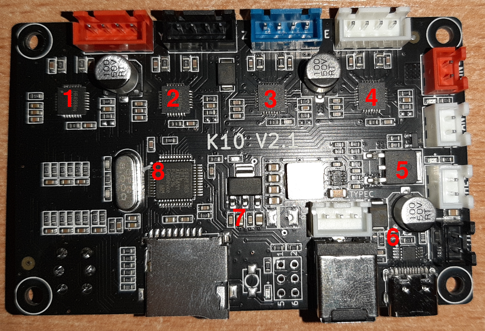
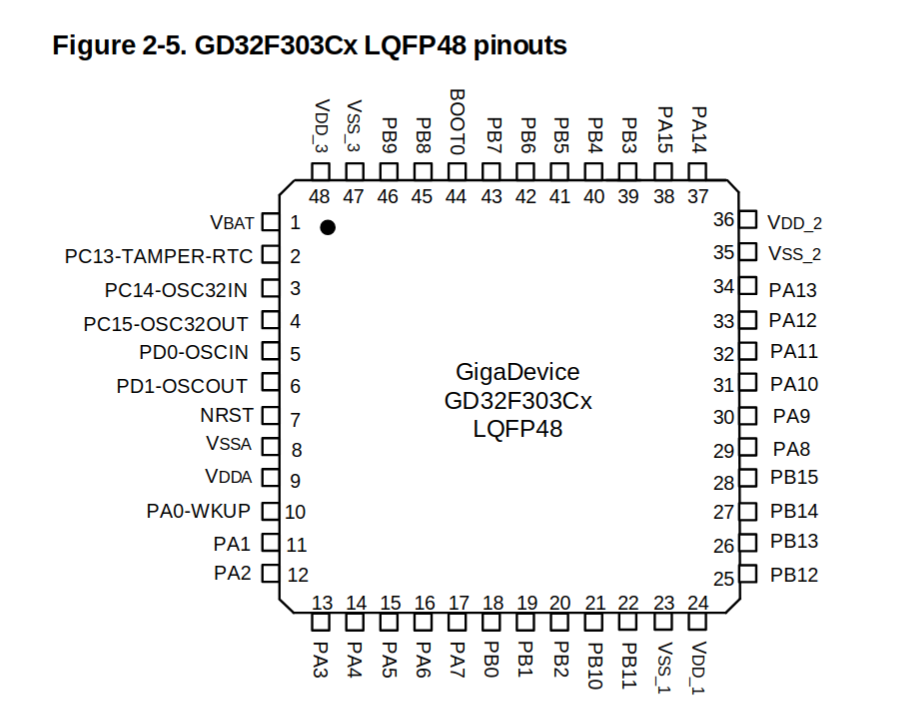

# Diagrama — Comunicación de la K10 con el host (3 vías)

La K10 **no tiene USB de datos de fábrica** (su USB-C es solo alimentación, USB-PD). Hay **tres**
formas de darle a Klipper un enlace con la K10. Todas trabajan a **3.3 V** (nivel del GD32).

- **A. USB nativo del GD32** (recomendada) — PA11/PA12 + pull-up 1.5 kΩ → cable USB. Aparece como
  dispositivo Klipper por USB. **Esquema de soldadura completo:** [k10-soldadura-usb.md](k10-soldadura-usb.md).
- **B. UART por GPIO de la Raspberry Pi** — sin comprar nada, 3 cables a la cabecera de la Pi.
- **C. UART + adaptador USB-TTL** — si prefieres por USB y ya tienes un adaptador 3.3 V.

> No necesitas comprar adaptador: con la **A** (cable USB) o la **B** (GPIO de la Pi) te apañas con lo
> que ya tienes. Detalle y seguridad en [docs/04](../docs/04-soldadura-uart-k10.md).

---

## Fotos reales de la placa (K10 V2.1)



`1-4` = drivers **HR4988** (X/Y/Z/E) · MCU **GD32F303RCT6** (centro) · MOSFET calefactor **HY1403** ·
regulador **AMS1117** · controlador **PW6606** (USB-PD).


---

## A. USB nativo del GD32 (recomendada — la opción que propusiste)

PA12 = USB D+, PA11 = USB D−. Necesita **1.5 kΩ de D+ a 3.3 V**. Ver el esquema eléctrico de soldadura
completo en **[k10-soldadura-usb.md](k10-soldadura-usb.md)**. Esquema lógico:

```text
     PLACA K10 (GD32F303)         RASPBERRY PI
    +----------------+        +------------------+
    |                |        |                  |
    | PA12 D+  o     |--------| o  D+   (USB)    |
    | PA11 D-  o     |--------| o  D-   (USB)    |
    | GND      o     |--------| o  GND           |
    |                |        |                  |
    +----------------+        +------------------+
     (+ pull-up 1.5 kΩ de PA12/D+ a 3.3 V — OBLIGATORIA)
     VBUS +5V del USB: NO conectar al MCU.  D+/D- cortos y trenzados.
```

Klipper: interfaz de comunicación **USB (PA11/PA12)**. Resultado: `/dev/serial/by-id/usb-Klipper_stm32f103xe_...`.

---

## B. UART por GPIO de la Raspberry Pi (sin comprar nada)

```text
    PLACA K10 (GD32F303, 3.3 V)            RASPBERRY PI  (cabecera GPIO, 3.3 V)
    +------------------------+            +------------------------------------+
    |                        |   cable A  |                                    |
    |   USART1 TX = PA9   o--|----------->|--o RXD = GPIO15   (pin fisico 10)  |
    |                        |   cable B  |                                    |
    |   USART1 RX = PA10  o--|<-----------|--o TXD = GPIO14   (pin fisico 8)   |
    |                        |   cable C  |                                    |
    |   GND               o--|------------|--o GND            (pin fisico 6)   |
    |                        |            |                                    |
    +------------------------+            +------------------------------------+

    Regla: TX de un lado --> RX del otro (cruzado). Si no conecta, intercambia A y B.
```

En la Pi: `sudo raspi-config` → Serial → consola por serie **NO**, hardware serial **SÍ**.
Klipper: comunicación **Serial (USART1, PA9/PA10)**. En `[mcu k10]`: `serial: /dev/ttyAMA0`.

---

## C. UART + adaptador USB-TTL (3.3 V)

```text
     PLACA K10 (3.3 V)         ADAPTADOR USB-TTL (3.3 V)
    +----------------+        +----------------------+
    |                |        |                      |
    | TX = PA9   o   |------->| o  RX                |
    | RX = PA10  o   |<-------| o  TX                |
    | GND        o   |--------| o  GND               |
    |                |        | VCC 3.3 V (NO usar)  |
    |                |        |                      |
    +----------------+        +----------------------+
              (el adaptador va por USB a la Pi)
```

Mismo cruce TX↔RX, GND común, VCC del adaptador sin conectar. Adaptador **en 3.3 V** (5 V daña el GD32).

---

## SWD — para flashear / volcar firmware (no es la comunicación de Klipper)

```text
    GD32 K10:   SWDIO = PA13     SWCLK = PA14     NRST = PB4     (+ GND y 3.3 V)

    Programador:  ST-Link V2     o     Raspberry Pi Pico (Picoprobe) + OpenOCD
```




---

## Tabla resumen de cableado

| Señal     | Pin K10 (GD32)        | Opción A — USB nativo   | Opción B — Pi GPIO    | Opción C — USB-TTL  |
|-----------|-----------------------|-------------------------|-----------------------|---------------------|
| D+ / TX   | PA12 (D+) / PA9 (TX)  | PA12 → D+ del cable USB | —                     | —                   |
| D- / RX   | PA11 (D-) / PA10 (RX) | PA11 → D- del cable USB | —                     | —                   |
| Pull-up   | —                     | 1.5 kΩ de PA12 a 3.3 V  | no aplica             | no aplica           |
| TX (UART) | PA9                   | —                       | → RXD GPIO15 (pin 10) | → RX del adaptador  |
| RX (UART) | PA10                  | —                       | → TXD GPIO14 (pin 8)  | → TX del adaptador  |
| GND       | GND                   | → GND del USB           | → GND (pin 6)         | → GND del adaptador |
